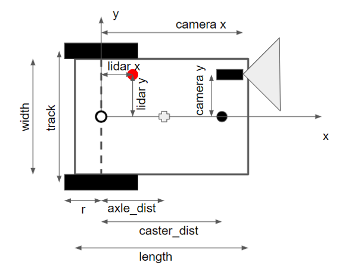
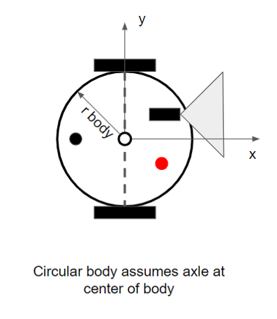
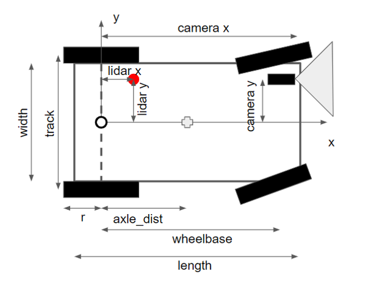

SimpleSim Ros Node
------

Overview
------
SimpleSim supports the simulation of differential drive and ackerman steer robots in a virtual 2D environment.  The images below detail the types of robots that are supported.

Usage
------
Please see the SimpleSim exmaple launch file (simple_sim.launch) for a working example.

Required Field Arguments
------
* field_image_file [Sting] - The playing field image file
* x_scale [double] - Number pixels / m in the image x-direction
* y_scale [double] - Number pixels / m in the image y-direction
* x_center_img [int] - Locatoin of x = 0 in the image x-dimesion
* y_center_img [int] - Location of y = 0 in the image x-dimesion
* img_view_scale [double] - Scaling of the viewed field image during simulation

Required Robot Arguments
------
* robot_type [string] { 'diff_drive_rect', 'diff_drive_circ' or 'acker_steer_rect' }

For diff_drive_rect robots
* robot_width [double]
* robot_length [double]
* rwheel [double]
* wheel_width [double]
* trackwidth [double]
* axle_dst [double]
* caster_dst [double]
* caster_radius [double]

For diff_drive_circ robots, using the diff_drive_rect parameters with the following exceptions
* robot_radius [double] (Used instead of robot_width and robot_length)
* axle_dst is assumed to be zero

For acker_steer_rect robots, using the diff_drive_rect parameters with the following exceptions
* wheelbase [double]
* max_steer [double]
* caster_dst and caster_radius are ignored 

Optional Sensing Arguments
------
Camera sensor (assumed forward facing and aligned with robot x-axis)
* camera_x [double]
* camera_y [double]
* camera_width [double]
* camera_length: [double]

Lidar sensor
* lidar_x [double]
* lidar_y [double]
* lidar_r [double]

Optional Arguments - Robot initial location
------
* Xr_init [m] - Initial robot X location
* Yr_init [m] - Initial robot Y location
* Theta_init [deg] - Initial robot rotation relative to X-axis

Optional Arguments - Obstructions
------
* rect[i] -  [ x1,y1,x2,y2,x3,y3,x4,y4 ] - Coordinates [m] of four sided polygon.  Please note that "i" = 0-9 is valid and points must be in clockwise order.
* circ[i] - [ xc,yc,r ] - Coordinates [m] of the center and radius of a circular obstruction.  Please note that "i" = 0-9 is valid.

Dynamic Configuation Parameters
------
* Camera Height [m] - The height of the camera (mounted over the center of the front axle.
* Camera Rot Deg [deg] - Rotation of the camera around robot local y-axis. 0 deg is aligned with the global X-Y plane pointed straight forward; 90 deg aligned with the global Y-Z plane pointed straight down.
* Focal Len [mm] - Camera focal length
* Cam Border On [bool] - Flag to turn on the camera image border on the playing field.  false = OFF, true = ON

* Lidar On [bool] - Flag to activate lidar scan. false = OFF, true =  ON
* Lidar Max Dist [m] - Maximum reported lidar scan distance
* Lidar Mkr Size [int] - Lidar marker size in pixels

* Exterior Walls [bool] - Flag to active exterior boundary walls. false = OFF, true = ON
* Obstructions [bool] - Flag to display obstructions.  false = OFF, true = ON
* Collison [int] - Flag to control conllision model.  0 = No collision, 1 = Soft collision, 2 = Firm collision

